# Evaluación Integradora: Alke Wallet (abp5)
## Fundamentos de bases de datos relacionales

### Paso 1 — Crear la Base de Datos

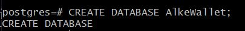  
*Figura 1: Crear la base de datos AlkeWallet*

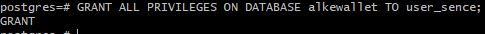  
*Figura 2: Otorgar Permiso base de datos AlkeWallet*

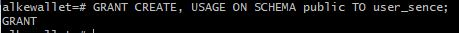  
*Figura 3: Otorgar Permiso Shema Public base de datos AlkeWallet*

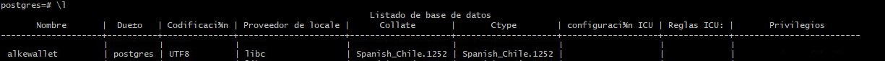  
*Figura 4: Ver base de datos AlkeWallet*

---

### Paso 2 — Crear las 3 Tablas (DDL)

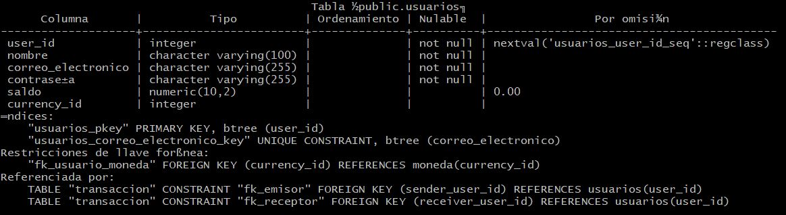  
*Figura 5: DESCRIBE Tabla Usuarios base de datos AlkeWallet*

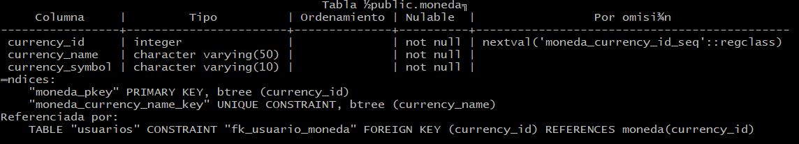  
*Figura 6: DESCRIBE Tabla Moneda base de datos AlkeWallet*

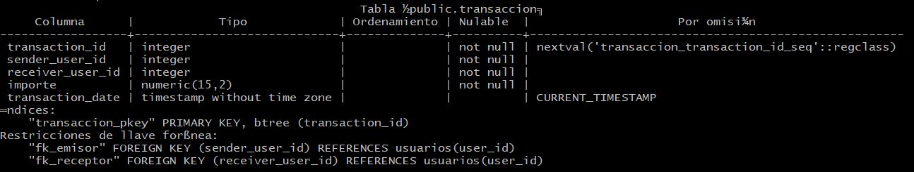  
*Figura 7: DESCRIBE Tabla Transacción base de datos AlkeWallet*

---

### Paso 3 — Insertar Datos de Prueba (DML)

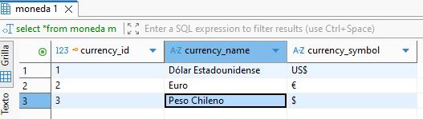  
*Figura 8: Inserción Monedas en tabla Moneda, base de datos AlkeWallet*

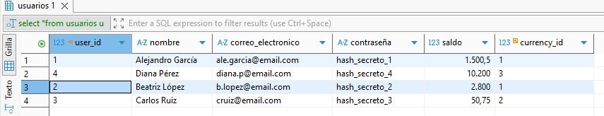  
*Figura 9: Inserción Usuarios en tabla Usuarios, base de datos AlkeWallet*

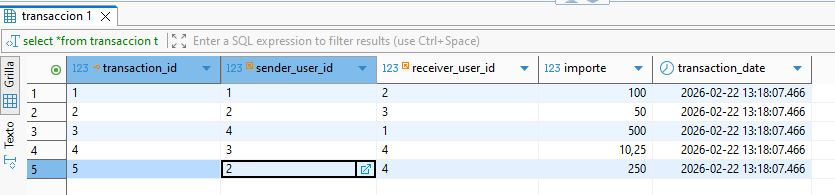  
*Figura 10: Inserción Transacciones en tabla Transacción, base de datos AlkeWallet*

---

### Paso 4 — Las 5 Consultas Requeridas

#### 1. Obtener el nombre de la moneda elegida por un usuario específico
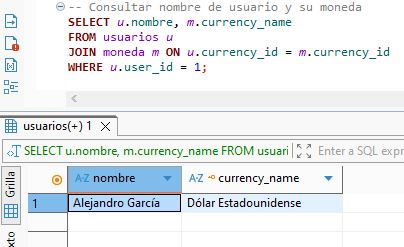  
*Figura 11: Resultados Consulta moneda usuario específico*

#### 2. Obtener todas las transacciones registradas
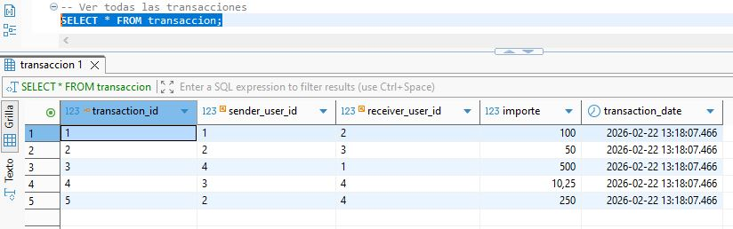  
*Figura 12: Resultados Consulta Transacciones*

#### 3. Obtener todas las transacciones realizadas por un usuario específico
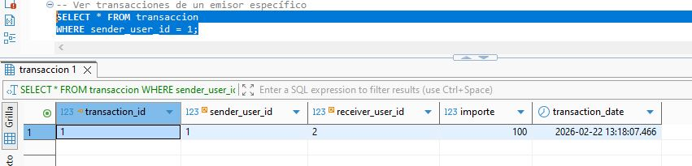  
*Figura 13: Resultados Consulta transacción usuario específico*

#### 4. Modificar el correo electrónico de un usuario específico
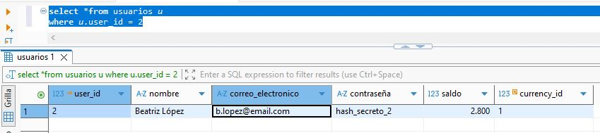  
*Figura 14: Resultados Consulta antes del Update*

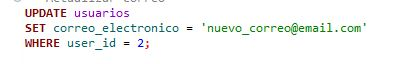  
*Figura 15: Consulta actualiza correo usuario específico*

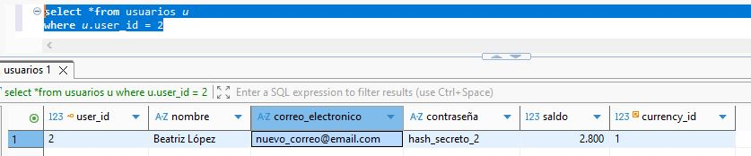  
*Figura 16: Resultados Consulta después de la actualización*

#### 5. Eliminar los datos de una transacción
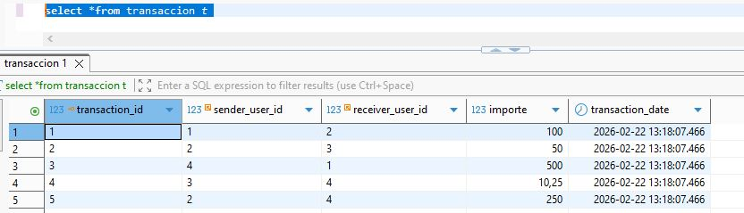  
*Figura 17: Resultados Consulta antes del delete*

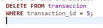  
*Figura 18: Consulta borrar transacción*

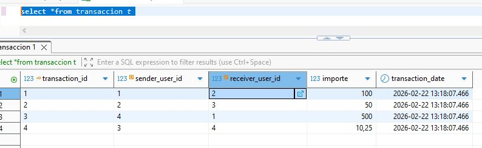  
*Figura 19: Resultados Consulta después de borrar transacción*

---

### Paso 5 — Transaccionalidad (ACID)

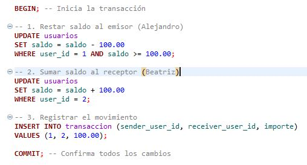  
*Figura 20: Implementación de transferencia de fondos (COMMIT)*

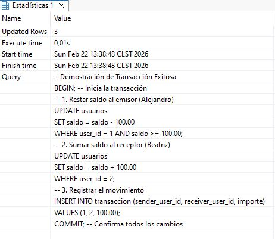  
*Figura 20: Resultados DBeaver (COMMIT)*

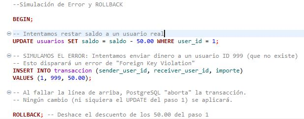  
*Figura 21: Simulación de error de integridad y reversión (ROLLBACK)*

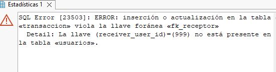  
*Figura 21: Resultados DBeaver (ROLLBACK)*